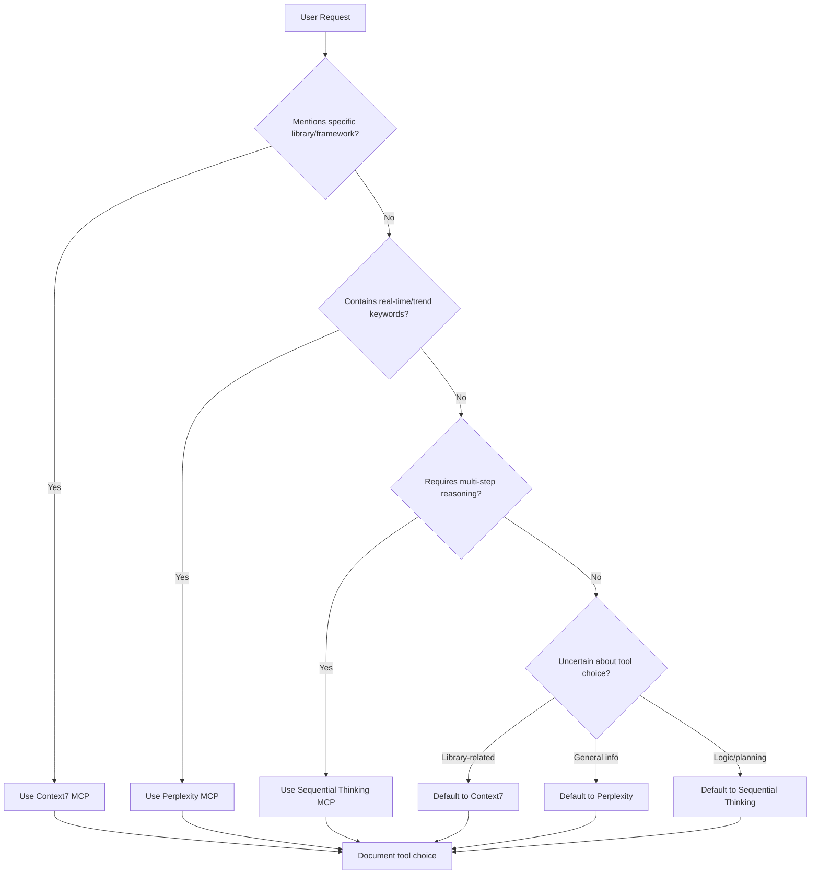

# Tool Selection Rules

---

## Purpose
This rule file guides the Augment Agent on when to use **Sequential Thinking MCP** (for complex problem-solving), **Perplexity MCP** (for real-time information), **Context7 MCP** (for library documentation), **Context Retrieval Tool** (for codebase analysis), **shadcn-ui Tool** (for UI components), or **Firecrawl-MCP Tool** (for web scraping) to provide optimal responses.

---

## 🚨 MANDATORY ENFORCEMENT RULES

### **ALWAYS APPLY - No Exceptions**
These rules MUST be followed automatically for every user request without being asked:

#### 1. **Pre-Implementation Analysis (REQUIRED)**
Before writing, editing, or implementing ANY code:
- **MUST** use Context Retrieval Tool to understand existing codebase patterns
- **MUST** check for similar existing implementations
- **MUST** analyze current architecture and coding standards
- **MUST** identify dependencies and integration points

#### 2. **Information Gathering Protocol (REQUIRED)**
For any technical request:
- **MUST** use Context7 MCP for library/framework documentation needs
- **MUST** use Perplexity MCP for current best practices and trends
- **MUST** use Sequential Thinking MCP for complex planning and architecture
- **MUST** gather ALL necessary information BEFORE making changes

#### 3. **UI Component Implementation (REQUIRED)**
When building UI components:
- **MUST** check shadcn-ui Tool first for available components
- **MUST** use Context Retrieval Tool to find existing UI patterns
- **MUST** ensure consistency with existing design system
- **MUST** validate accessibility and responsive design

#### 4. **Web Research Requirements (REQUIRED)**
When external data is needed:
- **MUST** use Firecrawl-MCP Tool for web scraping and content extraction
- **MUST** respect website terms of service and robots.txt
- **MUST** validate extracted data accuracy
- **MUST** supplement with Perplexity for context verification

#### 5. **Tool Selection Documentation (REQUIRED)**
For every response:
- **MUST** document which tools were used and why
- **MUST** explain the rationale for tool selection
- **MUST** note any limitations or assumptions
- **MUST** suggest follow-up verification when needed

#### 6. **Quality Assurance Protocol (REQUIRED)**
Before finalizing any implementation:
- **MUST** suggest writing or updating tests
- **MUST** recommend running tests to verify changes
- **MUST** identify potential breaking changes
- **MUST** consider security implications

---

## Tool Definitions

### Sequential Thinking MCP
- **Purpose**: Multi-step reasoning, planning, problem decomposition
- **Best for**: Complex logic, architecture design, debugging workflows
- **Data source**: Training data + reasoning capabilities

### Perplexity MCP
- **Purpose**: Real-time information retrieval and current knowledge
- **Best for**: Latest news, trends, general current information
- **Data source**: Live web search + current information

### Context7 MCP
- **Purpose**: Up-to-date library and framework documentation
- **Best for**: API references, specific library usage, version-specific docs
- **Data source**: Official documentation repositories + library sources

### Context Retrieval Tool
- **Purpose**: Codebase analysis and understanding existing code
- **Best for**: Finding existing implementations, understanding code structure, analyzing patterns
- **Data source**: Current codebase files and structure

### shadcn-ui Tool
- **Purpose**: UI component library access and implementation
- **Best for**: Getting shadcn/ui components, demos, and metadata
- **Data source**: shadcn/ui v4 component registry and examples

### Firecrawl-MCP Tool
- **Purpose**: Web scraping, content extraction, and website analysis
- **Best for**: Extracting content from websites, mapping site structure, deep research
- **Data source**: Live web content and structured data extraction

---

## Primary Decision Matrix

| Scenario | Sequential Thinking | Perplexity | Context7 | Context Retrieval | shadcn-ui | Firecrawl | Rationale |
|----------|-------------------|------------|----------|------------------|-----------|-----------|-----------|
| **Planning & Architecture** | ✅ Primary | ⚠️ Supplement | ⚠️ For implementation | ⚠️ For existing code | ❌ Avoid | ❌ Avoid | Logic-based, structured thinking |
| **Library Documentation** | ❌ Avoid | ❌ Avoid | ✅ Primary | ❌ Avoid | ❌ Avoid | ❌ Avoid | Need precise, current API docs |
| **Debugging Complex Issues** | ✅ Primary | ⚠️ Supplement | ⚠️ For API errors | ✅ For code analysis | ❌ Avoid | ❌ Avoid | Systematic analysis required |
| **Latest Framework Changes** | ❌ Avoid | ✅ Primary | ⚠️ Supplement | ❌ Avoid | ❌ Avoid | ⚠️ For research | General trends vs specific docs |
| **Algorithm Design** | ✅ Primary | ❌ Rarely needed | ❌ Rarely needed | ⚠️ For existing patterns | ❌ Avoid | ❌ Avoid | Timeless logic principles |
| **Security Vulnerabilities** | ⚠️ Supplement | ✅ Primary | ⚠️ For library-specific | ⚠️ For code audit | ❌ Avoid | ⚠️ For research | Critical current information |
| **API Usage Examples** | ❌ Avoid | ❌ Avoid | ✅ Primary | ⚠️ For existing usage | ❌ Avoid | ❌ Avoid | Need accurate, current syntax |
| **Framework Comparison** | ⚠️ Supplement | ✅ Primary | ⚠️ For specifics | ❌ Avoid | ❌ Avoid | ⚠️ For research | Broad current knowledge needed |
| **Codebase Understanding** | ⚠️ For analysis | ❌ Avoid | ❌ Avoid | ✅ Primary | ❌ Avoid | ❌ Avoid | Need to understand existing code |
| **UI Component Implementation** | ⚠️ For planning | ❌ Avoid | ⚠️ For docs | ⚠️ For existing components | ✅ Primary | ❌ Avoid | Need specific UI components |
| **Web Content Extraction** | ⚠️ For processing | ⚠️ For context | ❌ Avoid | ❌ Avoid | ❌ Avoid | ✅ Primary | Need to scrape/extract web data |
| **Research & Analysis** | ✅ For complex analysis | ✅ For current info | ⚠️ For specific docs | ⚠️ For code patterns | ❌ Avoid | ✅ For web research | Depends on research scope |

---

## Trigger Keywords & Patterns

### 🧠 Sequential Thinking Triggers
```
- "Plan", "Design", "Architecture", "Break down"
- "Step by step", "How should I approach"
- "Debug this issue", "Analyze the problem"
- "What's the best way to structure"
- "Help me think through", "Walk me through"
- "Design patterns", "Algorithm for"
- "Refactor", "Optimize", "Improve"
```

### 🔍 Perplexity Triggers
```
- "Latest trends", "Current state of", "Recent developments"
- "What's happening with", "Industry news"
- "Best practices 2024/2025", "Modern approach"
- "Security advisory", "Vulnerability reports"
- "Market comparison", "Popular alternatives"
- "Community opinion", "Developer sentiment"
```

### 📚 Context7 Triggers
```
- "How to use [library]", "API for [framework]"
- "[Library] documentation", "Official docs for"
- "Examples of [specific function]", "Syntax for"
- "Version X.X features", "Migration from v1 to v2"
- "Configuration options", "Parameters for"
- "Import statement", "Installation guide"
- "TypeScript types for", "Interface definition"
```

### 🔍 Context Retrieval Triggers
```
- "Find existing code", "How is [feature] implemented"
- "Show me similar patterns", "Existing examples of"
- "Where is [function/class] defined", "Code structure"
- "How does the current codebase handle", "Existing implementation"
- "Find all usages of", "Dependencies between"
- "Code analysis", "Understand this codebase"
- "Similar functionality", "Existing patterns"
```

### 🎨 shadcn-ui Triggers
```
- "shadcn component", "shadcn/ui [component]"
- "UI component for", "Need a [button/form/dialog]"
- "shadcn demo", "component example"
- "UI library component", "Design system component"
- "React component", "Component source code"
- "shadcn blocks", "UI patterns"
- "Component metadata", "Available components"
```

### 🌐 Firecrawl-MCP Triggers
```
- "Scrape website", "Extract content from"
- "Get data from URL", "Website content"
- "Map website structure", "Crawl site"
- "Research from web", "Deep web research"
- "Extract information from", "Website analysis"
- "Search and scrape", "Content extraction"
- "Generate llms.txt", "Website mapping"
```

---

## Decision Flow Logic



### Step-by-Step Process:
1. **Check for library/framework mentions** → If found, use Context7
2. **Scan for real-time/trend keywords** → If found, use Perplexity
3. **Check for complex reasoning needs** → If found, use Sequential Thinking
4. **When uncertain, default based on context**:
   - Library/API questions → Context7
   - General current info → Perplexity
   - Logic/planning → Sequential Thinking
5. **Always document the tool choice and rationale**

---

## Security & Safety Guidelines

### 🔒 When Using Perplexity MCP
- **Always verify** code suggestions from real-time sources
- **Flag for human review** any security-related code changes
- **Sanitize outputs** before presenting to user
- **Cross-reference** critical information with multiple sources
- **Warn users** when implementing bleeding-edge practices

### 🧠 When Using Sequential Thinking MCP
- **Acknowledge limitations** if information might be outdated
- **Suggest verification** for time-sensitive implementations
- **Recommend Context7/Perplexity follow-up** for current best practices

### 📚 When Using Context7 MCP
- **Verify library version** matches user's project requirements
- **Check for deprecated methods** in older documentation
- **Cross-reference** with official sources if Context7 data seems incomplete
- **Flag breaking changes** between versions when relevant
- **Supplement with Perplexity** for community best practices

### 🔍 When Using Context Retrieval Tool
- **Respect existing code patterns** and architectural decisions
- **Consider code quality** and maintainability when suggesting changes
- **Verify code context** before making recommendations
- **Check for recent changes** that might affect analysis
- **Supplement with Sequential Thinking** for complex refactoring decisions

### 🎨 When Using shadcn-ui Tool
- **Verify component compatibility** with user's React/Next.js version
- **Check for custom styling** requirements and theme integration
- **Consider accessibility** requirements for components
- **Validate component props** and TypeScript types
- **Supplement with Context7** for framework-specific integration

### 🌐 When Using Firecrawl-MCP Tool
- **Respect robots.txt** and website terms of service
- **Rate limit requests** to avoid overwhelming target websites
- **Validate extracted data** for accuracy and completeness
- **Consider data privacy** implications when scraping
- **Supplement with Perplexity** for context and verification

---

## Documentation Requirements

### Tool Usage Tracking
Always include a brief note about tool selection:

```markdown
<!-- Tool Used: Sequential Thinking MCP -->
<!-- Rationale: Multi-step architecture planning task -->

<!-- Tool Used: Perplexity MCP -->
<!-- Rationale: Needed current industry trends -->

<!-- Tool Used: Context7 MCP -->
<!-- Rationale: Required up-to-date Supabase API documentation -->

<!-- Tool Used: Context Retrieval Tool -->
<!-- Rationale: Needed to understand existing codebase structure -->

<!-- Tool Used: shadcn-ui Tool -->
<!-- Rationale: Required specific UI component implementation -->

<!-- Tool Used: Firecrawl-MCP Tool -->
<!-- Rationale: Needed to extract content from external website -->
```

### Hybrid Approach Documentation
When using multiple tools:
```markdown
<!-- Approach: Context7 for API docs + Sequential Thinking for implementation plan -->
<!-- Phase 1: Get current API documentation (Context7) -->
<!-- Phase 2: Plan integration strategy (Sequential Thinking) -->

<!-- Approach: Perplexity for trends + Context7 for specific implementation -->
<!-- Phase 1: Research current best practices (Perplexity) -->
<!-- Phase 2: Get specific library documentation (Context7) -->

<!-- Approach: Context Retrieval for existing code + shadcn-ui for new components -->
<!-- Phase 1: Analyze existing UI patterns (Context Retrieval) -->
<!-- Phase 2: Get new component implementations (shadcn-ui) -->

<!-- Approach: Firecrawl for data + Sequential Thinking for processing -->
<!-- Phase 1: Extract website content (Firecrawl) -->
<!-- Phase 2: Analyze and structure data (Sequential Thinking) -->
```

---

## Edge Cases & Fallbacks

### Uncertain Scenarios
- **Library/API questions**: Default to Context7, fall back to Perplexity if unavailable
- **General current info**: Default to Perplexity when information recency is unclear
- **Complex reasoning**: Use Sequential Thinking for follow-up analysis
- **Hybrid needs**: Combine tools (Context7 + Sequential Thinking is common)

### Tool Failure Handling
- If **Context7 fails**: Fall back to Perplexity for general docs + acknowledge limitations
- If **Perplexity fails**: Fall back to Sequential Thinking + acknowledge staleness
- If **Sequential Thinking** seems insufficient: Supplement with Context7/Perplexity
- Always **explain the limitation** and suggest alternative approaches

---

## User Override Protocol

### Explicit Tool Requests
- **Honor user requests** for specific tools
- **Provide gentle warning** if choice seems suboptimal
- **Explain rationale** for the recommended alternative

### Example Responses:
```
User: "Use sequential thinking to find the latest React features"
Response: "I'll use Sequential Thinking as requested, though Context7 MCP
would be better for current React documentation. Proceeding with Sequential
Thinking based on my training data..."

User: "Get Supabase docs with Perplexity"
Response: "I'll use Perplexity as requested, though Context7 MCP would provide
more precise Supabase documentation. Using Perplexity for broader context..."
```

---

## Practical Examples

### ✅ Sequential Thinking Scenarios
```
❓ "Help me design a bookmark manager architecture"
🧠 Use Sequential Thinking: Architecture planning requires structured reasoning

❓ "Debug this complex authentication flow"
🧠 Use Sequential Thinking: Systematic debugging approach needed

❓ "What's the best algorithm for searching bookmarks?"
🧠 Use Sequential Thinking: Algorithm design is timeless logic
```

### ✅ Perplexity Scenarios
```
❓ "What are the current trends in web development for 2024?"
🔍 Use Perplexity: General industry trends and current state

❓ "Has there been any recent security issues with npm packages?"
🔍 Use Perplexity: Current security landscape and recent events

❓ "What's the developer sentiment around new JavaScript frameworks?"
🔍 Use Perplexity: Community opinions and current discussions
```

### ✅ Context7 Scenarios
```
❓ "How do I use Supabase real-time subscriptions?"
📚 Use Context7: Specific API documentation needed

❓ "Show me the latest Next.js 14 API route syntax"
📚 Use Context7: Framework-specific documentation

❓ "What are the TypeScript types for React useState?"
📚 Use Context7: Precise type definitions needed
```

### ✅ Context Retrieval Scenarios
```
❓ "Find existing authentication implementation in this codebase"
🔍 Use Context Retrieval: Need to understand existing code structure

❓ "How does the current app handle user sessions?"
🔍 Use Context Retrieval: Analyzing existing implementation patterns

❓ "Show me similar components to what I'm building"
🔍 Use Context Retrieval: Finding existing code patterns and examples
```

### ✅ shadcn-ui Scenarios
```
❓ "I need a button component for my React app"
🎨 Use shadcn-ui: Specific UI component needed

❓ "Show me shadcn/ui dialog component with demo"
🎨 Use shadcn-ui: Component implementation and usage example

❓ "What shadcn components are available for forms?"
🎨 Use shadcn-ui: Component discovery and metadata
```

### ✅ Firecrawl-MCP Scenarios
```
❓ "Extract all blog posts from this website"
🌐 Use Firecrawl-MCP: Web content extraction needed

❓ "Research competitor pricing from their website"
🌐 Use Firecrawl-MCP: Deep web research and data extraction

❓ "Map the structure of this documentation site"
🌐 Use Firecrawl-MCP: Website structure analysis and mapping
```

### ✅ Hybrid Scenarios
```
❓ "Plan a migration from React to Next.js with latest features"
🧠 Sequential Thinking: Migration planning strategy
📚 Context7: Next.js documentation and API references

❓ "Implement Supabase auth following current best practices"
📚 Context7: Supabase auth documentation
🔍 Perplexity: Current security best practices

❓ "Design a real-time chat system with modern tools"
🧠 Sequential Thinking: System architecture and planning
📚 Context7: WebSocket/real-time library documentation
🔍 Perplexity: Current real-time technology landscape

❓ "Build a dashboard with existing patterns and new components"
� Context Retrieval: Analyze existing dashboard patterns
🎨 shadcn-ui: Get new component implementations
🧠 Sequential Thinking: Plan integration strategy

❓ "Research competitor features and implement similar functionality"
🌐 Firecrawl-MCP: Extract competitor website data
🔍 Context Retrieval: Find existing similar features
🧠 Sequential Thinking: Plan implementation approach

❓ "Modernize legacy UI components with current best practices"
� Context Retrieval: Understand existing component structure
🎨 shadcn-ui: Get modern component alternatives
🔍 Perplexity: Research current UI/UX trends
📚 Context7: Get framework-specific migration docs
```

---

## Quick Reference Checklist

Before responding to any request:

- [ ] **Scan for library/framework mentions** → Context7
- [ ] **Scan for real-time/trend keywords** → Perplexity
- [ ] **Assess complexity level** (simple vs multi-step) → Sequential Thinking
- [ ] **Consider information recency needs** → Perplexity vs Context7
- [ ] **Check for explicit user tool preference**
- [ ] **Select appropriate tool(s)** (single or hybrid approach)
- [ ] **Document tool choice rationale**
- [ ] **Include security/version warnings if needed**

---

## Rule Updates & Maintenance

- **Review monthly** for effectiveness and edge cases
- **Update trigger keywords** based on user patterns  
- **Refine decision logic** based on feedback
- **Add new scenarios** as they emerge

---

*Last Updated: 2024-12-19*
*Version: 1.0*
